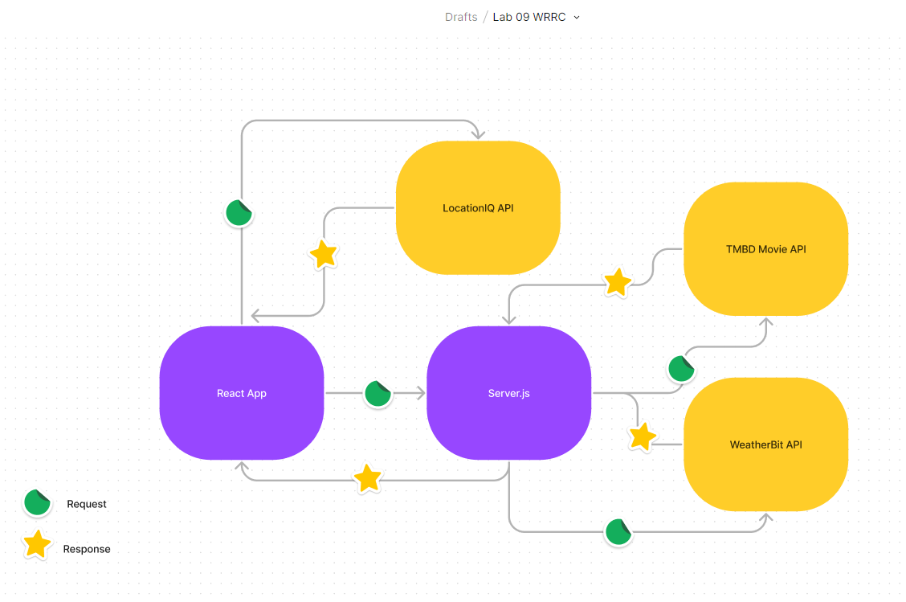

# City Explorer

**Author**: Austin Limanek
**Version**: 1.0.0 (increment the patch/fix version number if you make more commits past your first submission)

## Overview

Exploring the locationIQ API and becoming more familiar with the React system.

## Getting Started

The user would need an internet browser and follow this link: `https://main--cityexplorerajl.netlify.app/`

## Architecture

Visual Studio Code was used to write the code. npm was used to install axios, react, and react-bootstrap. The bootstrap library was used for components. Netlify was used to depoly the site. The project repository is located on GitHub: `https://github.com/AustinLimanek/cityExplorer`

## Change Log

18-07-2022 7:00pm - Application now has a fully-functional express server, with a GET route for the location resource.
8:00pm - Map is visible on website
8:30pm - CSS has been updated
9:30pm - Website is fully deployed

## Credit and Collaborations

Lucy Gelderloos - worked on lab 6 and 8 data flow diagram.
Erin Ranta - sketched out server extension in lab 7.
Mandy Menson - diagramed utilization of TMBD API to pull movie information && help with Netlify to locationIQ token access.
Anthony Johnson & Caelin Hargrave - data flow diagram for the full city-explorer application and it's communication with the city-explorer-api server, which connects to three API technologies.

